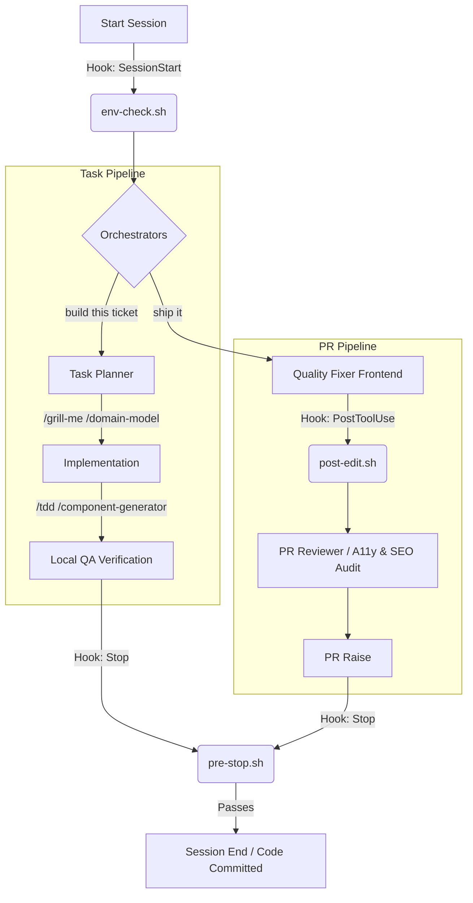

# 🤖 Claude Code Developer Workflow

[](LICENSE)
[](https://docs.anthropic.com/claude/docs/claude-code)
[](#lifecycle-hooks)
[](#mcp-servers)

An automated, high-discipline agentic development workflow configuration for **Claude Code**. It turns isolated AI behaviors into a unified, sequential, and highly disciplined engineering system that automatically enforces requirements, styling conventions, and strict code-quality gates before any code is committed or submitted.

---

## 📐 Architecture & Pipeline Flow

This workflow coordinates Claude's lifecycle using **Agents** (orchestrators), **Skills** (interactive execution steps), and **Hooks** (automated gatekeepers).



---

## 🛠️ Folder Structure

```filetree
.claude/
├── settings.json          # Main settings, hook configs, and MCP servers
├── agents/                # Multi-step orchestrator pipelines
│   ├── task-pipeline.md   # Ticket classification & build pipeline
│   ├── pr-pipeline.md     # Pre-shipping validation & PR creator
│   ├── a11y-audit.md      # WCAG 2.1 AA accessibility specialist
│   └── seo-audit.md       # SEO, structured data, and meta tag auditor
├── hooks/                 # Lifecycle shell scripts triggered by Claude events
│   ├── env-check.sh       # Verifies local env vars match template configs
│   ├── post-edit.sh       # Instantly checks files after edit/write tools
│   └── pre-stop.sh        # Runs typechecks, tests, and duplicate scans on exit
├── skills/                # Domain-specific developer skills (commands)
│   ├── tdd/               # Enforces Red-Green-Refactor TDD flow
│   ├── task-planner/      # Generates structured implementation plans
│   ├── grill-me/          # Pressure-tests feature specs step-by-step
│   ├── domain-model/      # Aligns nomenclature with GLOSSARY.md
│   ├── css-design-system/ # Manages tokens, variables, & styling rules
│   ├── quality-fixer-frontend/ # Automates lint, formatting, and test fixes
│   ├── qa-validate/       # Playwright browser integration testing
│   ├── pr-raise/          # Strict gated push & GitHub PR creation
│   ├── pr-review/         # Comprehensive diff review & issue labeling
│   ├── figma-to-code/     # Translates Figma design MCP data to React/Svelte
│   ├── component-generator/# Scaffolds UI components with tests
│   └── prompt-optimizer/  # Rewrites vague prompts to high-performance prompts
└── references/            # Editorial guidelines and project positionings
    ├── voice-and-editorial.md
    ├── positioning.md
    └── writing-patterns.md
```

---

## 🤖 Orchestrator Agents (`.claude/agents/`)

Orchestrator agents chain multiple skills in a structured sequence to execute broad workflow stages.

### 📋 Task Pipeline (`task-pipeline.md`)
* **Trigger phrases:** `"build this ticket"`, `"task pipeline"`, `"implement this"`, `"start work on"`
* **Flow:** Classifies the issue (bug/feature/refactor) $\rightarrow$ Runs `/task-planner` $\rightarrow$ Pressure-tests assumptions $\rightarrow$ Runs `/tdd` during implementation $\rightarrow$ Quality gates check.

### 🚀 PR Pipeline (`pr-pipeline.md`)
* **Trigger phrases:** `"ship it"`, `"PR pipeline"`, `"full PR"`
* **Flow:** Requirements check $\rightarrow$ CSS/convention audit $\rightarrow$ Runs `/quality-fixer-frontend` $\rightarrow$ Generates automated release documentation $\rightarrow$ Opens pull request using `/pr-raise`.

### ♿ Accessibility Audit (`a11y-audit.md`)
* **Focus:** WCAG 2.1 AA standards.
* **Flow:** Analyzes DOM structure, keyboard usability (tab order, focus-visible), ARIA roles, visual color contrast (minimum 4.5:1), and semantic HTML correctness.

### 🔍 SEO Audit (`seo-audit.md`)
* **Focus:** Auditing search visibility, heading hierarchy, unique element IDs, Next.js/Svelte metadata, and OpenGraph/JSON-LD structured data formats.

---

## ⚡ Automated Git Lifecycle Hooks (`.claude/hooks/`)

Defined inside `.claude/settings.json`, these hooks act as automated quality gates. They prevent Claude from submitting code that doesn't meet project standards.

### 1. `SessionStart` $\rightarrow$ `env-check.sh`
* **Purpose:** Runs when Claude starts a session.
* **Validation:** Reads `.env.example` and compares it to `.env.local` or `.env`. Logs warnings and stops if required local configuration keys are missing.

### 2. `PostToolUse` (Edit | Write) $\rightarrow$ `post-edit.sh`
* **Purpose:** Runs immediately after Claude modifies or creates a file.
* **Validation:**
  * **Prettier**: Rejects files not formatted correctly.
  * **ESLint**: Catches syntax and linting errors.
  * **Styling Units**: Enforces `rem` for typography and `px` for spacing/borders.
  * **Tailwind Optimization**: Prevents repeated utility class clusters of 6+ utilities.
  * **Color Custom Properties**: Rejects hardcoded hex/rgb colors; mandates CSS variable tokens.
  * **Stacking Context**: Catches hardcoded `z-index` numbers; mandates tokenized indexes.
  * **Bundle-Size Guard**: Blocks wildcard imports (`lucide-react`) or bloated libraries (`lodash`, `moment`).

### 3. `Stop` $\rightarrow$ `pre-stop.sh`
* **Purpose:** Runs when Claude attempts to finish a turn and stop.
* **Validation:**
  * Runs TypeScript compiler (`tsc --noEmit`) to verify type safety.
  * Scans across files for duplicate exported function names to prevent redundant logic.
  * Runs the project's test suite (`npm test`, `pnpm test`, etc.) in non-watch mode.
  * **Reentry Block:** If checks fail, it returns an exit code `2`, which **forces Claude to stay active** to fix the reported bugs before concluding.

---

## 🛠️ Custom Developer Skills (`.claude/skills/`)

Skills are specialized tools containing detailed prompt guidelines that Claude invokes to execute specific tasks.

| Skill | Purpose | Key Commands / Behavior |
| :--- | :--- | :--- |
| **`/tdd`** | Enforces test-driven development cycles. | Red (write failing test) $\rightarrow$ Green (make it pass) $\rightarrow$ Refactor. |
| **`/task-planner`** | Translates tickets to step-by-step execution plans. | Prepares test strategy, risk analysis, and Git branch structure. |
| **`/grill-me`** | Interrogates specifications before coding. | Asks clarifying questions one-at-a-time to eliminate ambiguity. |
| **`/domain-model`**| Coordinates a domain vocabulary. | Generates and aligns naming structures with `GLOSSARY.md`. |
| **`/css-design-system`**| Configures CSS custom properties. | Audits spacing/typography scales, ensures strict theme tokens. |
| **`/quality-fixer-frontend`**| Fixes failing lint, typecheck, or tests. | Runs compiler and linters, auto-fixing issues where possible. |
| **`/qa-validate`** | End-to-end user journey validation. | Automates local Playwright/Chrome-devtools testing steps. |
| **`/pr-raise`** | Pre-PR gated publisher. | Runs format, lint, typecheck, and build before calling `gh pr create`. |
| **`/pr-review`** | Code reviewer. | Scours diffs for architectural issues and logs them by severity. |
| **`/figma-to-code`**| UI designer tool. | Translates Figma mockups to CSS-token-aligned component code. |

---

## 🔌 Model Routing & MCP Servers

The workflow utilizes custom MCP (Model Context Protocol) servers to hook Claude up to external developer ecosystems:

### Configured MCP Servers (in `.claude/settings.json`)
* **Playwright MCP (`@playwright/mcp`)** - Orchestrates headless browser interactions for automated E2E testing.
* **Chrome DevTools MCP (`chrome-devtools-mcp`)** - Monitors live web pages, network calls, console logs, and errors during verification.
* **Context7 MCP (`@upstash/context7-mcp`)** - Fetches latest developer documentation for standard UI framework tools (React, Next.js, Tailwind).

### External Integrations
* **Jira / Atlassian MCP** - Connects Claude to your project tickets for planning.
  ```bash
  claude mcp add --transport sse atlassian https://mcp.atlassian.com/v1/sse
  ```
* **Figma Plugin** - Reads vector design nodes directly from mockups.
  ```bash
  claude plugin install figma@claude-plugins-official
  ```

---

## 🚀 How to Setup

To import this workflow setup into an existing development repository:

### 1. Copy the configuration folder
Clone or copy the `.claude/` directory and `CLAUDE.md` into the root of your project:
```bash
git clone https://github.com/Manoj-M-S/claude-code-workflow.git
cp -r claude-code-workflow/.claude ./
cp claude-code-workflow/CLAUDE.md ./
```

### 2. Make hooks executable
Ensure the lifecycle shell scripts are executable:
```bash
chmod +x .claude/hooks/*.sh
```

### 3. Verify GitHub CLI authentication
This workflow uses the GitHub CLI (`gh`) to automate Pull Request creation. Confirm you are authenticated:
```bash
gh auth status
```
If you aren't logged in, run:
```bash
gh auth login
```

### 4. Boot up Claude Code
Launch Claude Code in your project root. It will read the `.claude/settings.json` and initialize the workflow hooks:
```bash
claude
```

---

## 🤝 Contributing

We welcome contributions to make this workflow configuration even more robust! Feel free to:
1. Open an issue to discuss design enhancements or new skills.
2. Submit a Pull Request. Please make sure that all local checks pass (run `.claude/hooks/pre-stop.sh` manually to verify).

## 📄 License

This workflow setup is open-source software licensed under the [MIT License](LICENSE).
